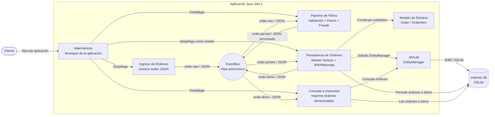

```mermaid
flowchart LR

    Cliente([Cliente])

    subgraph App["Aplicación Java Vert.x"]
        Main["MainVerticle<br/>Arranque de la aplicación"]

        Ingreso["Ingreso de Órdenes<br/>Genera orden JSON"]
        Bus(("EventBus<br/>Pipe asincrónico"))

        Filtros["Pipeline de Filtros<br/>Validación + Precio + Fraude"]

        Persistencia["Persistencia de Órdenes<br/>Worker Verticle + JPA/Hibernate"]

        Modelo["Modelo de Dominio<br/>Order / OrderItem"]
        JPA["JPAUtil<br/>EntityManager"]

        Printer["Consulta e Impresión<br/>Imprime órdenes almacenadas"]
    end

    DB[("ordenes.db<br/>SQLite")]

    Cliente -->|"Ejecuta aplicación"| Main

    Main -->|"Despliega"| Ingreso
    Main -->|"Despliega"| Filtros
    Main -->|"Despliega como worker"| Persistencia
    Main -->|"Despliega"| Printer

    Ingreso -->|"order.raw / JSON"| Bus
    Bus -->|"order.raw / JSON"| Filtros

    Filtros -->|"order.persist / JSON procesado"| Bus
    Bus -->|"order.persist / JSON"| Persistencia

    Persistencia -->|"Construye entidades"| Modelo
    Persistencia -->|"Solicita EntityManager"| JPA
    JPA -->|"JDBC SQLite"| DB
    Persistencia -->|"Persiste órdenes e ítems"| DB

    Persistencia -->|"order.done / JSON"| Bus
    Bus -->|"order.done / JSON"| Printer

    Printer -->|"Consulta órdenes"| JPA
    Printer -->|"Lee órdenes e ítems"| DB
```