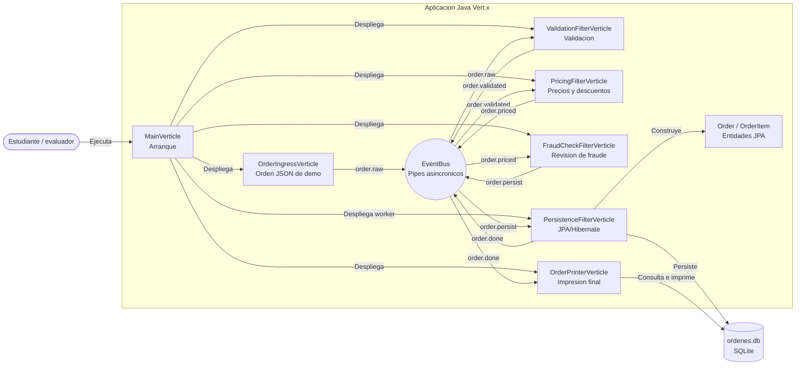

# Diagrama de arquitectura

Este diagrama resume el flujo principal del taller. La aplicacion se organiza como un pipeline **Pipe & Filter** donde cada filtro se implementa como un `Verticle` y se comunica mediante canales del `EventBus`.

